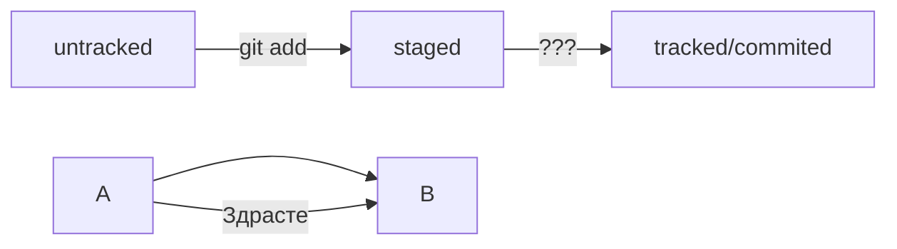

```mermaid
 graph LR;
untracked -- "git add" --> staged;
staged -- "???" --> tracked/commited;
%% стрелка без текста для примера:
A --> B
A-- "Здрасте"-->B
```
<привет>

#### статус кво  
# *статус кво* 
hhello
